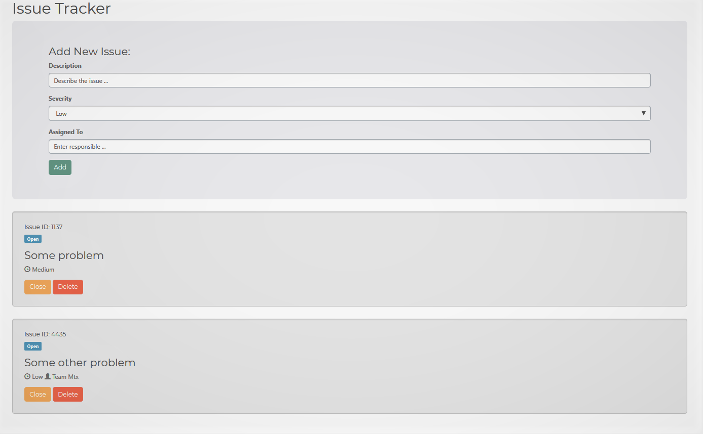

# Issuely
A simple javascript issue tracker.

### Usage
Run this on any webserver. Maybe rename index.html though.

Form to submit issue takes in a description, severity and optional team/employee assignment. Every new issue gets assigned a 4 digit ID. Search functionality is work in progress.
